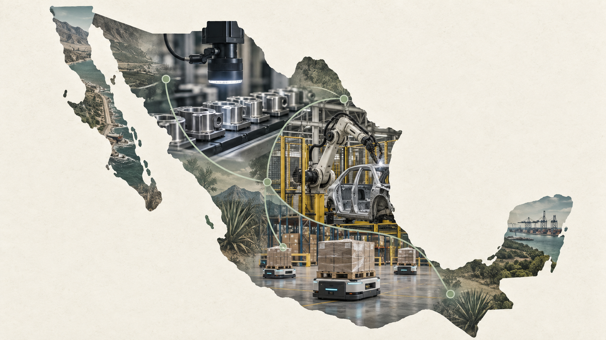
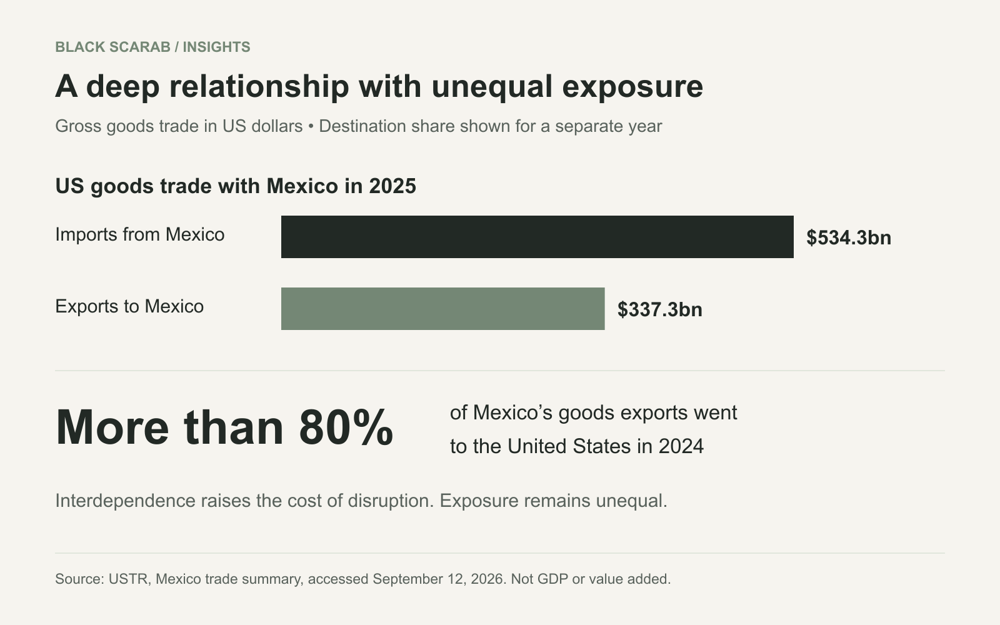
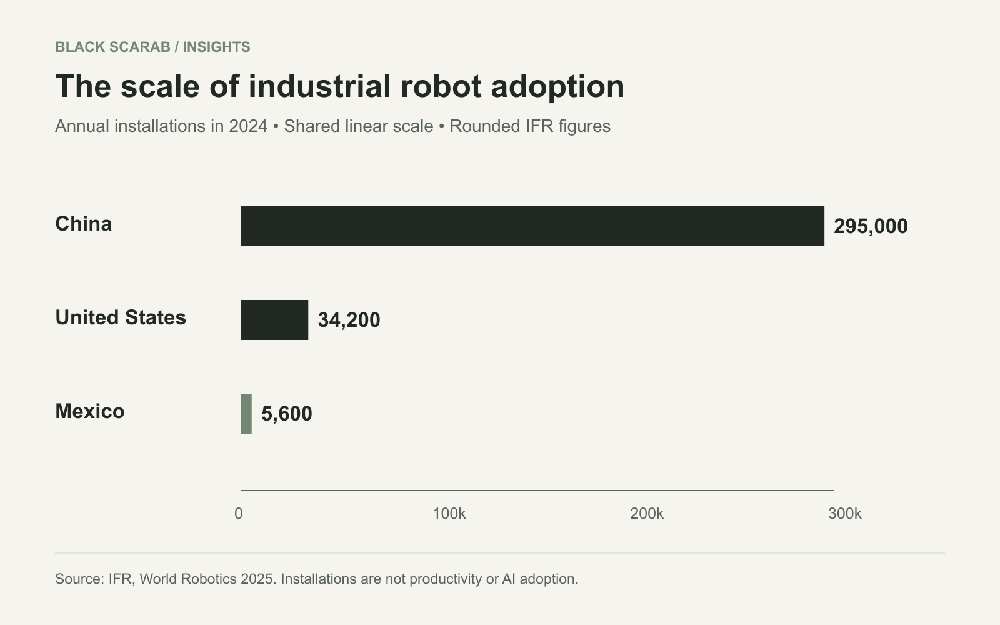
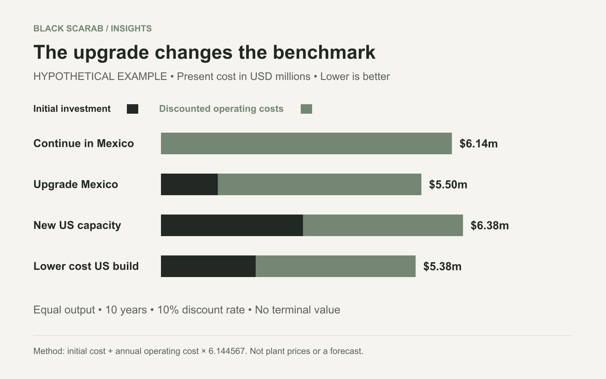
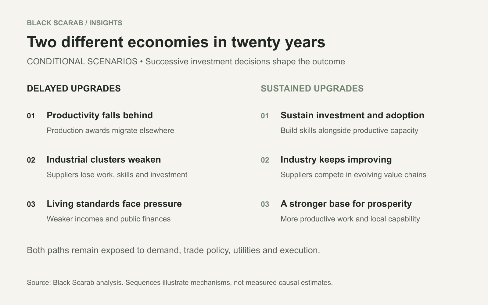

# Mexico Cannot Afford to Lose the Physical AI Race

By Rodolfo Garcia Calderoni, CFA

Mexico’s manufacturing future depends on turning nearshoring into a lasting productivity advantage. That makes deep adoption of physical AI a strategic necessity and a major opening for the companies that can deliver it.

Original AI generated editorial illustration by Black Scarab depicting physical AI adoption across Mexico’s industrial economy. Connections are conceptual.

Mexico’s most dangerous industrial competitor is a factory that has not been built yet. It may sit north of the border, close to its customers. It may sit in China, surrounded by suppliers that keep improving together. What matters is whether it can deliver a better product at a lower total cost when the next production contract is awarded.

For years, Mexico has combined proximity to the United States, competitive labor costs, industrial experience and regional supply chains. Trade tensions with China have made that combination more valuable. But an advantage created partly by the cost of human work becomes less secure as machines absorb more of that work.

Mexico will have a harder time defending its industrial position in the long run without deep adoption of physical AI. The country needs to use the current opening to build efficient plants, capable local suppliers and systems that can perceive, adapt and improve production. Staying and expanding in Mexico must remain economically compelling as factories elsewhere become smarter.

The danger begins with the next investment decision. Existing plants can remain open while new products, engineering work and additional capacity go elsewhere. By the time the loss becomes obvious in the industrial landscape, several investment cycles may already have passed. Mexico needs to strengthen its position while it still has the orders, relationships and operating base from which to do so.

The horizon is twenty years. If production systems elsewhere keep improving while Mexico’s capabilities fall behind, the cumulative gap could change the country’s economic position. The stakes extend to how Mexico earns income, supports its industrial communities and finances its development. Its response needs to begin while it still has a strong manufacturing base from which to advance.

That need creates an opening for robotics and physical AI companies across the world. Mexico has a large industrial base whose competitiveness increasingly depends on the capabilities they are building. A credible strategy for entering this market should be taking shape now, while customers are deciding which technologies and partners will underpin their next decade of production.

## A valuable relationship with unequal exposure

The United States bought $534.3 billion of goods from Mexico in 2025 and sold it $337.3 billion, putting bilateral goods trade at $871.6 billion. More than 80 percent of Mexican goods exports went to the United States in 2024, according to [USTR’s trade summary](https://www.ustr.gov/countries-regions/americas/mexico). The two countries are deeply connected, but Mexico’s export dependence makes the exposure asymmetric.

A tariff on an intermediate component can raise costs for an American manufacturer as well as damage a Mexican supplier. That creates resistance to disruption. It does not make disruption impossible. Governments can accept economic costs in pursuit of political, industrial or security objectives, and firms can redesign sourcing over time.

USTR’s [July 2026 negotiating agenda](https://www.ustr.gov/about/policy-offices/press-office/press-releases/2026/july/united-states-and-mexico-convene-mexico-city-third-bilateral-negotiating-round-related-joint-review) explicitly included automotive rules of origin, steel and aluminum, economic security and other bilateral issues. Associated Press reporting at the start of the review described an uncertain negotiation that could extend for months. [AP’s account](https://apnews.com/article/usmca-mexico-canada-trade-nafta-4531f12f1a59cb2b2e20bcdbdd9d47b5) provides independent context for the commercial uncertainty.

This is why proximity should be treated as an asset to improve, not an insurance policy. A manufacturer deciding where to expand has to evaluate market access alongside delivered cost, reliability, origin documentation and the ability to launch on schedule. A cheaper workcell cannot erase an unfavorable trade rule. A favorable trade rule cannot rescue a factory that repeatedly misses quality or delivery requirements.

Black Scarab chart using USTR data. Dollar flows cover 2025; the export destination share covers 2024. Gross trade flows are not domestic value added or GDP.

## Nearshoring has to become productive capacity

Investment determines how much of the nearshoring opportunity Mexico can capture. In a May 2026 [Dallas Fed analysis](https://www.dallasfed.org/research/economics/2026/0512), economists model a GDP level gain from trade spillovers of about 1.1 percentage points when investment adjusts, versus about 0.4 percentage points with a fixed capital stock. The larger gain comes when additional demand draws out additional productive capacity. That is the economic logic Mexico needs to act on.

The important distinction is between receiving demand and building the capacity to serve it. Additional orders can fill unused space in an existing plant. They do not necessarily create a deeper supplier base, stronger engineering capabilities or a new generation of production equipment.

An earlier [Dallas Fed study from December 2024](https://www.dallasfed.org/research/economics/2024/1205) found that new foreign direct investment had not matched the enthusiasm around nearshoring and that reinvested earnings accounted for most inflows. It also explained how contract manufacturing and shelter arrangements can expand activity without appearing as a wave of directly owned foreign factories. That historical finding is a warning against equating every export gain with a completed relocation.

The useful question is what the next peso of investment leaves behind. A building can house production for a time. A network of qualified suppliers, process engineers and service technicians can help win the next product generation. The second kind of investment makes the first more durable.

## China is raising the competitive benchmark

China’s manufacturing strength gives Mexico little room for complacency. In February 2026, the [IMF described robust Chinese exports alongside weak domestic demand](https://www.imf.org/en/news/articles/2026/02/18/cf-how-chinas-economy-can-pivot-to-consumption-led-growth). Expanding consumption and upgrading production can reinforce one another: a larger domestic market supports industrial scale, while better factories remain formidable competitors abroad.

The IFR’s [World Robotics 2025 report](https://ifr.org/worldrobotics/report-2025) records about 295,000 industrial robot installations in China during 2024, compared with 34,200 in the United States and 5,600 in Mexico. China represented 54 percent of worldwide installations. Mexican installations declined 4 percent, with automotive accounting for 63 percent. Mexico’s task is to broaden adoption across the industrial base while its largest global competitors keep investing.

China installed roughly 53 times as many industrial robots as Mexico in that year. The countries differ greatly in industrial scale, but the investment gap illustrates the momentum Mexico faces. Each wave of deployment also gives equipment suppliers, integrators and factory teams more opportunities to refine processes and make the next installation easier.

The [IFR’s Americas release](https://ifr.org/downloads/press_docs/2025-09-25-IFR_press_release_Americas_in_English.pdf) puts China’s operational stock at roughly 2.03 million robots and the US stock at 393,700 in 2024. It also reports that domestic suppliers served 57 percent of China’s robot market. The competitive challenge includes a growing ecosystem of equipment makers and deployment experience, not just a collection of machines.

Mexico does not need to match China’s national robot count. It needs relevant plants and supply chains to match the quality, responsiveness and delivered economics required to retain business. Importing dependable equipment can be part of that strategy. Building the ability to integrate, maintain and improve it locally is what turns the purchase into industrial capability.

Original Black Scarab chart using rounded IFR World Robotics 2025 figures for calendar 2024. These counts do not measure AI adoption, productivity or robots per worker.

## The threshold is delivered cost per good unit

A low hourly wage is valuable only in relation to the work it produces. The manufacturing comparison must include output per hour, saleable yield, downtime, supervision, maintenance, energy, tooling, floor space and working capital. Freight, insurance, border delays and applicable duties then connect the factory gate to the customer.

Capital must also be priced over time. Compare the present value of equipment, integration, operating expense and replacement costs against the present value of useful output. A machine that works three shifts can spread its cost over more units than the same machine serving an intermittent order book. A nominally fast system can become expensive if it often waits for upstream parts or downstream capacity.

As automation reduces the labor required for each accepted unit, the wage difference between two locations carries less weight in the investment decision. Quality, utilization, logistics and capital efficiency carry more. Mexico can defend its position by combining its existing advantages with the same productivity improvements available to competitors.

Physical AI matters because it can extend automation into work that changes. Perception can help a machine locate an unfamiliar part. Adaptive control can accommodate variation. Better task software can reduce the effort needed to introduce a product. When those capabilities work reliably in production, they expand the range of processes that can be automated economically.

The pace will differ by task. Integration, tooling, energy and financing still shape the result. But Mexico’s strategic response should begin wherever the economics already work, building the experience needed to adopt the next generation as it becomes commercially useful.

## The decision to upgrade versus rebuild

Consider a deliberately simplified example for the next comparable production program. A Mexican plant can continue with an incremental annual delivered operating cost of $1 million. An upgrade costs $1.2 million today and reduces that annual cost to $700,000. A new US alternative requires $3 million today and costs $550,000 annually. All values are hypothetical and represent only the relevant program costs, not market quotations or the full price of a factory.

Assume equal annual output, equal quality and customer service, immediate commissioning, a ten year horizon, a 10 percent annual discount rate and no terminal value. Operating costs are paid at each year end. The present value factor is 6.145. Continuing costs approximately $6.14 million; upgrading costs $5.50 million; building the US alternative costs $6.38 million. In this example, the Mexican upgrade is the least expensive choice despite the US option’s lower annual operating cost.

If the US initial investment falls to $2 million, its present cost falls to $5.38 million and it becomes slightly cheaper than the Mexican upgrade. At the other assumptions, the break even US investment is approximately $2.12 million. The result is sensitive to capital cost because the upgrade itself has already captured much of the operating improvement.

This is the strategic point: Mexico’s investment changes the benchmark a competitor has to beat. It does not make relocation irrational forever. Better US productivity, incentives, a shift in demand or higher border costs could change the answer again. Conversely, commissioning delays and customer requalification can make a new facility less attractive than this immediate startup example suggests.

An established Mexican operation can bring available capacity, a qualified workforce, customer approvals and supplier relationships to the next decision. Those assets matter through the future spending and ramp time they can save. The comparison should price replacement investment, shutdown costs and qualification alongside continuing operations. Taxes, depreciation benefits, financing structure, salvage, demand risk and currency movements are excluded from this simplified example.

Black Scarab hypothetical investment model, not observed plant costs or a forecast. Ten years, 10 percent discount rate, equal output, year end operating costs and no terminal value. Assumptions and exclusions are explained above.

### Hypothetical sensitivity to the discount rate

| Annual discount rate | Continue in Mexico | Upgrade Mexico | US alternative at $3 million |
| --- | --- | --- | --- |
| 6 percent | $7.36 million | $6.35 million | $7.05 million |
| 10 percent | $6.14 million | $5.50 million | $6.38 million |
| 15 percent | $5.02 million | $4.71 million | $5.76 million |

Present cost equals initial investment plus annual operating cost multiplied by the ten year annuity factor. Lower present cost is preferred only under the equal output assumptions.

## Two different Mexican economies in twenty years

In the first scenario, Mexico’s factories improve slowly while production systems across the world become dramatically more capable and cheaper to operate. Over twenty years, successive product generations and capacity expansions move toward those systems. Mexico retains some advantages in specialized or protected markets, but much of its industrial base loses the ability to compete on the economics that determine large production awards.

Local suppliers then lose opportunities to learn the next process. Skilled technicians leave for better prospects. Maintenance and engineering networks grow elsewhere. The country can remain a significant exporter while losing bargaining power over the more valuable parts of the production system. A healthy current order book would not disprove that risk.

In the second scenario, Mexico starts investing heavily now and sustains that effort over decades. Each generation of sensing, robotics and industrial intelligence improves an operating base that is already producing for demanding customers. By the end of the twenty year horizon, Mexico combines proximity and industrial relationships with competitive automated production, capable suppliers and the expertise to keep upgrading them.

The difference is the kind of economy that develops around the factories. One path risks concentrating Mexico in lower value work while technology ownership, engineering and productive investment accumulate elsewhere. The other builds a larger base of technical services, integration, tooling, maintenance and industrial businesses able to sell into the automated economy. The near term window matters because these capabilities accumulate over time.

The choice will play out unevenly. A highly capable automotive or electronics plant can coexist with poorly equipped suppliers nearby. The national challenge is to broaden improvement beyond showcase facilities so that the surrounding production network becomes an advantage too. Deep adoption means carrying the technology through the supply chain, where many of the remaining bottlenecks sit.

The timing comes from product cycles, equipment replacement and contract awards. Waiting for a definitive moment when robots become cheaper than workers is the wrong trigger. Each missed program can move customer knowledge and engineering experience elsewhere. The window is measured in opportunities to build capability before those commitments are made.

Black Scarab scenarios over a twenty year horizon. The paths illustrate how successive investment decisions can change the economy; they are not forecasts or assigned probabilities.

## When an industrial advantage erodes, the whole country pays

Consider a country whose manufacturing proposition gradually loses its force. Competitors become better at producing the same goods, introducing new products and serving customers at a lower delivered cost. As that advantage grows and persists across investment cycles, customers gain a stronger reason to place production elsewhere. For Mexico, a sustained failure to keep pace would put one of the foundations of its economic development under pressure.

Proximity remains useful, but its value has limits when the production gap becomes large. Saving time in transit or reducing freight expense must compensate for the disadvantage inside the factory. Existing contracts and qualifications can delay a sourcing change; they cannot indefinitely guarantee the next contract. As automation reduces the labor content of production, wage restraint offers a progressively weaker response. The plant needs a more productive system.

The threat would reach both export plants and producers serving Mexico itself. International customers could award new programs to more efficient locations. Mexican customers could increasingly buy cheaper imported goods. Domestic manufacturers might seek protection, but high trade barriers would shift part of the burden onto households and businesses buying their products. Protecting a cost gap is an expensive substitute for closing it.

As production migrates, the damage can compound through industrial clusters. Tooling shops, component makers, maintenance providers and logistics businesses can lose volume and investment. Lower demand makes their own upgrades harder to finance. Skilled workers move toward better opportunities, and customers grow comfortable with suppliers elsewhere. Over twenty years, Mexico could lose much of the ecosystem that once made it an attractive place to manufacture.

The employment problem would be broader than displaced assembly jobs. Engineers, technicians, supervisors and local service businesses depend on the continued renewal of production. If the economy cannot develop equally productive alternatives, workers may move into lower paid or less stable activities. Industrial cities could face weaker household spending, falling demand for commercial property and a narrower base of viable local businesses. The risk is a prolonged loss of earning power across communities.

That would put pressure on the country’s external finances. Weaker manufacturing exports would reduce one source of foreign earnings while Mexico continued to need imported equipment, technology and other goods. Adjustment could come through a weaker currency, lower imports, new exports or changes in capital flows. Currency depreciation can help some producers, but it also raises the domestic cost of imported machinery and other purchases. It cannot by itself recreate lost industrial capability.

Public finances would face pressure from both directions: weaker taxable income and business activity, alongside greater demands for worker support, retraining and regional recovery. Manufacturing’s current share of roughly one fifth of GDP shows the scale of the exposed economic base. The broader danger is that Mexico would have fewer resources to fund the infrastructure and education needed to rebuild its position, just when that investment becomes more urgent.

Cheaper foreign production would also benefit consumers and businesses that use imported inputs. Mexico could develop new competitive activities, and the adjustment would depend on those opportunities. But cheaper goods do not automatically replace the incomes lost in a weakened industrial region. The national challenge would be to create productive ways to earn a share of the new economy, rather than participate mainly as a buyer of what other countries produce.

The possibility of persistent divergence has a foundation in economic research. A [2020 IMF working paper](https://www.imf.org/en/publications/wp/issues/2020/09/11/will-the-ai-revolution-cause-a-great-divergence-49734) models how greater robot productivity can favor economies that already hold more robots and complementary capital. In one extension, a country relatively abundant in unskilled labor can experience a lasting deterioration in its terms of trade and GDP. It is a theoretical mechanism rather than a forecast for Mexico, but it explains why technological progress elsewhere can become a national development problem when domestic capabilities fail to keep up.

The strategic consequence is diminished room to maneuver. Dependence on imported industrial systems becomes more difficult to manage when a country has also lost local integration, maintenance and process expertise. A supplier interruption, technology restriction or financing shock can then be harder to absorb. Economic independence requires the capability to operate, adapt and improve the systems on which production depends.

Twenty years of divergence would be much harder to repair than today’s adoption gap. Recovery could require rebuilding suppliers, recruiting expertise, restoring infrastructure and persuading customers to qualify a production base they have already replaced. Mexico should invest heavily while it can build from its existing strength. The danger of waiting is that the country may eventually need the same modernization with less income, less expertise and fewer customers available to finance it.

## The first projects should solve expensive problems

The near term opportunity is often inside an existing factory. Inspect a defect that generates costly returns. Automate a repetitive transfer that prevents a machine from running through an additional shift. Improve pallet handling where manual work creates a bottleneck. Reduce changeover effort where frequent product variation makes conventional automation uneconomic.

A hypothetical metal parts supplier illustrates the sequence. First measure spindle utilization, part availability, inspection failures and operator interventions. If the real constraint is missing material or a long tool change, adding a robot may simply create a machine that waits. If consistent loading is the constraint, machine tending with a suitable gripper and reliable exception handling may produce useful additional hours.

A hypothetical electronics supplier has a different problem. A vision system may make sense when defects are visually observable and there is enough representative data to validate detection. The commercial test includes false rejects, missed defects, rework and traceability. It is not the accuracy score of a model on a convenient demonstration set.

A hypothetical packaging operation needs to test actual boxes, labels, reflective surfaces, damaged packaging and product changes. Useful throughput includes recovery from the difficult cases. Removing one visible operator while creating a hidden remote supervision burden can move expense without improving the process.

### A practical first deployment screen

| Application | What to measure | What can defeat the case |
| --- | --- | --- |
| Visual quality inspection | Escaped defects, false rejects, rework and inspection time | Unrepresentative data, changing lighting or defects that cameras cannot observe |
| Machine tending | Useful machine hours, loading time and interventions | Inconsistent fixtures, upstream shortages or unreliable recovery |
| Palletizing and material movement | Delivered throughput across the full shift | Poor flow design, unstable loads or blocked routes |
| Adaptive finishing or welding | Accepted process quality and variation handled | Tool wear, difficult qualification or insufficient process control |

Black Scarab application framework. These are potential use cases, not claims of deployments by named customers.

## The factory stack must survive the real plant

The useful system begins with sensing and ends with a verified production result. Cameras, depth sensors or other instruments observe the work. An industrial computer interprets the observations. Task software requests an action. A robot controller or programmable controller executes within defined operating limits. The plant’s quality and production systems record whether the result is acceptable.

Local computation can reduce dependence on an external network for time sensitive decisions. Cloud services can support fleet analysis, software distribution and model improvement. Neither removes the need for calibration, stable lighting, industrial networking, access control, backups and a recovery procedure when the system fails.

The bill of materials must include the manipulator or mobile base, controller, sensing, compute, gripper or process tool, fixtures, guarding and safety equipment, electrical work and network connections. Integration with the existing manufacturing execution and quality systems can be as important as the robot itself. The safety function requires its own engineering and validation; a learned model’s confidence score is not a safety guarantee.

The strongest commercial offer fits the equipment already operating in the plant. Buyers need a supported hardware matrix, controller compatibility, component availability and dependable local replacement times. Suppliers that make their technology work within these constraints can reach more facilities and reduce the friction of each expansion.

Mexico’s service layer is consequently part of the product. Spanish language training, accessible documentation, spare components, remote diagnosis and an accountable local technician determine how quickly production resumes. A startup that cannot explain who arrives when a critical cell stops has not finished designing its commercial offer.

## Mexico belongs in the global robotics growth strategy

Mexico’s need to upgrade translates into a commercial opportunity across the factory stack. A manufacturer trying to defend an export program may need better inspection, adaptive handling, machine tending, production software or more dependable material movement. The opportunity reaches companies building robot intelligence, sensing and integration tools as well as those selling complete machines.

The existing industrial base is the starting market. Plants already have customers, equipment and processes whose performance can be measured. A supplier that improves an expensive constraint can attach its product to an operating budget and a business outcome. That is a stronger foundation for adoption than asking a customer to purchase technology in anticipation of an undefined future use.

The concentration of Mexico’s robot installations in automotive also points to the work ahead. Broad adoption requires solutions that fit different volumes, product mixes and levels of technical capability. A successful deployment model for a large assembly plant may need a different commercial package to reach its smaller suppliers. Financing, simpler integration and local support can make the difference between an interested customer and an installed system.

Entrepreneurs across the globe should build a deliberate route into Mexico while these choices are taking shape. Customer qualification, partner development and production validation take time. Starting after demand becomes obvious leaves less time to build references, understand purchasing decisions and establish the service network required to win the work.

There is also a compounding advantage to entering well. Each successful installation can produce a reference account, a better understanding of local operating conditions and a more repeatable implementation. The strongest position will belong to companies that turn early projects into a dependable way of serving the next plant. Mexico’s industrial urgency becomes their opportunity to build a durable business.

## A market entry strategy built around repeatability

A credible Mexico strategy starts with a narrow process and an industrial cluster the company can support well. Map the plants where that process matters, the people who control the budget and the integrators already trusted to work on the equipment. The first account needs a process owner, an operations sponsor, usable baseline data and a budget attached to an expensive problem.

Build the commercial package around the buyer’s operating reality. Define who installs the cell, who trains the team in Spanish, where replacement parts are held and who responds when production stops. Agree on responsibilities between the technology company and its local partners before the first pilot. These decisions belong in the market entry plan because they determine whether a technical success can become a repeat order.

A paid pilot should specify the production mix, hours of operation, success criteria and handling of exceptions. Acceptance should depend on sustained useful output and quality under agreed conditions. Tie expansion to that evidence. A polished demonstration with selected parts is a sales milestone, not a production acceptance test.

The next installation is the test of the business model. If the same process requires a complete redesign at every site, the company may be building an engineering services business with software inside it. That can be valuable, but the staffing, margins and financing needs differ from a product that deploys repeatedly with limited customization.

Capital purchase, leasing, subscriptions and payments linked to useful output are alternative contract structures. Lower initial payment does not remove economic cost. Buyers need to see service exclusions, minimum volumes, software charges, downtime allocation, termination rights and ownership of production data. Suppliers taking utilization risk need a balance sheet that can survive it.

The quotation should make the expansion case visible. Separate equipment, engineering, installation, training, maintenance, software and likely consumables. Show which expenses recur and which work can be reused at the second site. A customer should be able to see how the first deployment becomes the beginning of a broader productivity program.

## Industrial policy has to reach beyond the robot

Mexico has policy tools on which to build. Hacienda’s [Plan México tax incentive summary](https://www.estimulosfiscales.hacienda.gob.mx/es/efiscales_mediante_decreto/Plan_Mexico) describes accelerated deductions for qualifying new fixed assets and additional deductions related to training and innovation. Subject to project eligibility, these measures can support the investment and workforce development that a broader modernization effort requires.

The stronger policy agenda would connect equipment adoption to the conditions that make it productive. Shared training facilities, supplier development, accessible financing and practical demonstration centers can reduce the cost of the first serious deployment. Support should reward measured improvements and transferable skills rather than a count of robots purchased.

The [OECD’s research on nearshoring](https://www.oecd.org/en/publications/harnessing-nearshoring-opportunities-in-mexico-by-boosting-productivity-and-fighting-climate-change_0ca7fc0a-en.html) identifies transport and digital connectivity, regulation, the rule of law, renewable energy and water scarcity as constraints. A plant full of advanced equipment still needs reliable utilities and a dependable route to market.

Small and medium suppliers deserve particular attention. A sophisticated final assembly plant remains exposed if its upstream network cannot meet tolerances, document quality or deliver consistently. Financing and technical assistance that help those suppliers upgrade can strengthen several customers at once. Imported hardware does not prevent domestic value creation when integration, tooling, maintenance and process knowledge develop locally.

Public support should accelerate productive investment and make its results accountable. Measure additional capacity, supplier participation, training outcomes and sustained utilization. Tie continued support to performance. With limited fiscal resources, the objective should be to develop capabilities that continue earning their place after the incentive ends.

## The workforce is part of the advantage

Manufacturing generated approximately 20.1 percent of Mexico’s GDP in 2024, according to the [World Bank’s manufacturing value added series](https://data.worldbank.org/indicator/NV.IND.MANF.ZS?locations=MX). With roughly one fifth of the economy tied directly to manufacturing, the ability to retain and expand production is a national economic priority.

The employment stakes are equally substantial. [INEGI reported](https://www.inegi.org.mx/contenidos/saladeprensa/boletines/2024/IOE/IOE2024_12.pdf) 9.7 million people working in manufacturing in October 2024, or 16.3 percent of employment. Decisions about the next factory program reach beyond the plant into household income, supplier businesses and the prospects of industrial communities.

Automation can displace particular tasks and jobs even when it improves a plant’s long term prospects. A serious strategy budgets for that transition. Operators can contribute the tacit knowledge needed to diagnose exceptions and improve a cell, but movement into maintenance, quality or programming requires training and cannot simply be assumed.

A country should not define success as keeping wages low enough to postpone investment. Higher productivity creates room for better pay, stronger suppliers and a larger base of skilled work, although those gains depend on how firms and institutions distribute them. The alternative of losing future production programs can also damage employment, with fewer opportunities to shape the transition.

Industrial resilience is therefore partly a question of retaining the capacity to solve problems locally. A factory that depends on a single overseas expert for every failure has installed automation without developing much autonomy. Training, documentation and service capability are productive assets in their own right.

## Turning adoption into a durable advantage

Automation can also expand the market for capable suppliers. [World Bank research summarized in 2019](https://blogs.worldbank.org/en/developmenttalk/what-does-rise-robots-mean-trade) found that robot adoption in advanced economies was associated with greater imports from developing countries, including intermediate goods. Mexico can participate in that growth by remaining a competitive part of the production network. The strategic risk is falling behind as that network becomes more demanding.

If deployment and maintenance costs remain high, automation spreads more slowly. Highly variable, low volume processes may continue to favor people or simpler mechanization. If trade barriers rise enough, even a very efficient Mexican factory may lose access to a customer. If electricity, water or security deteriorate, better workcells may not offset the broader disadvantage.

The priority is to improve the processes that decide whether a plant wins business. In some sectors, that means more reliable handling and inspection. In others, it means faster product changes, better process control or stronger supplier coordination. A national strategy becomes useful when it translates into these specific operating improvements.

A3’s September 2026 [industry report on Mexican automation](https://www.automate.org/robotics/industry-insights/the-rise-of-automation-in-mexico-digital-transformation-redefines-emerging-industries) describes an established manufacturing platform and interviews automation suppliers about growing demand. Mexico already has a base from which to expand. The next step is to make successful adoption easier to repeat across more facilities and more levels of the supply chain.

Track awarded programs, expansion spending, supplier qualification, useful uptime, scrap, customer delivery and the time needed to commission a second site. Robot counts help describe adoption, but they cannot show whether a plant is earning enough to reinvest. If installations rise while utilization and domestic capability stagnate, the strategy is missing its objective.

## Black Scarab verdict

Mexico’s challenge is to sustain an industrial economy that can support rising living standards twenty years from now. If productivity rests primarily on the price of labor while competitors build more capable production systems, defending that position will become increasingly difficult. Deep adoption of physical AI should be part of the country’s industrial strategy, combining its location, suppliers and workforce with technology that keeps improving what those assets can produce.

That creates a significant opportunity for robotics and physical AI entrepreneurs around the world. Mexico should have a defined place in their growth plans, supported by target accounts, local partners, a financing approach and a service model. The companies that build those capabilities early will be better positioned to turn the need for modernization into repeatable commercial deployments.

The country and the companies supplying it have a shared interest in moving before the next wave of investment is committed elsewhere. Every successful upgrade can strengthen a plant’s bid for future work and give its technology partner a foundation for expansion. Nearshoring opened the door. Deep adoption is how Mexico can keep earning the business that comes through it.

## Sources and analytical method

Research checked September 12, 2026. Sources and observation years are identified alongside the evidence. The scenarios, application examples and investment model are Black Scarab analysis. The financial example is hypothetical, with equal output assumed across alternatives and the principal exclusions disclosed in the text.

The four supporting figures are original Black Scarab graphics. The cover is an AI generated editorial illustration. No generated image represents a real product installation. The investment model uses present cost because output is assumed identical across alternatives. It does not estimate employment effects, GDP losses, market size or a date when national manufacturing costs reach parity.

## References

* [IFR, World Robotics 2025, September 25, 2025. Calendar 2024 installations](https://ifr.org/worldrobotics/report-2025)
* [IFR, Americas release, September 25, 2025. Operational stocks and adoption](https://ifr.org/downloads/press_docs/2025-09-25-IFR_press_release_Americas_in_English.pdf)
* [USTR, Mexico trade summary, accessed September 12, 2026. 2025 trade and 2024 exposure](https://www.ustr.gov/countries-regions/americas/mexico)
* [Reyes Heroles, Torres and Morales Burnett, Dallas Fed, May 12, 2026. Trade spillover model](https://www.dallasfed.org/research/economics/2026/0512)
* [Dallas Fed, December 5, 2024. Nearshoring and investment composition](https://www.dallasfed.org/research/economics/2024/1205)
* [IMF, February 18, 2026. China’s consumption transition](https://www.imf.org/en/news/articles/2026/02/18/cf-how-chinas-economy-can-pivot-to-consumption-led-growth)
* [USTR, July 17, 2026. Third bilateral negotiating round agenda](https://www.ustr.gov/about/policy-offices/press-office/press-releases/2026/july/united-states-and-mexico-convene-mexico-city-third-bilateral-negotiating-round-related-joint-review)
* [Associated Press, June 30, 2026. North American trade negotiations](https://apnews.com/article/usmca-mexico-canada-trade-nafta-4531f12f1a59cb2b2e20bcdbdd9d47b5)
* [González Pandiella and Maravalle, OECD, May 7, 2024. Nearshoring constraints](https://www.oecd.org/en/publications/harnessing-nearshoring-opportunities-in-mexico-by-boosting-productivity-and-fighting-climate-change_0ca7fc0a-en.html)
* [A3, September 4, 2026. Automation in Mexico and supplier interviews](https://www.automate.org/robotics/industry-insights/the-rise-of-automation-in-mexico-digital-transformation-redefines-emerging-industries)
* [Hacienda, Plan México incentives, accessed September 12, 2026](https://www.estimulosfiscales.hacienda.gob.mx/es/efiscales_mediante_decreto/Plan_Mexico)
* [INEGI, December 2024 labor release. October 2024 manufacturing employment](https://www.inegi.org.mx/contenidos/saladeprensa/boletines/2024/IOE/IOE2024_12.pdf)
* [World Bank, World Development Indicators, 2024 manufacturing value added; retrieved September 12, 2026](https://data.worldbank.org/indicator/NV.IND.MANF.ZS?locations=MX)
* [Alonso, Berg, Kothari, Papageorgiou and Rehman, IMF Working Paper 20/184, September 11, 2020. Automation and economic divergence](https://www.imf.org/en/publications/wp/issues/2020/09/11/will-the-ai-revolution-cause-a-great-divergence-49734)
* [Rijkers, Bastos and Artuc, World Bank, April 4, 2019. Robot adoption and trade](https://blogs.worldbank.org/en/developmenttalk/what-does-rise-robots-mean-trade)
