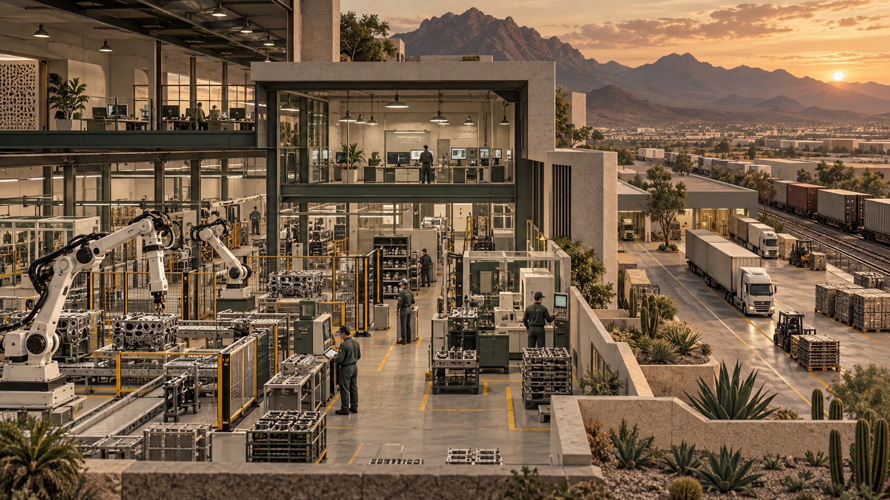
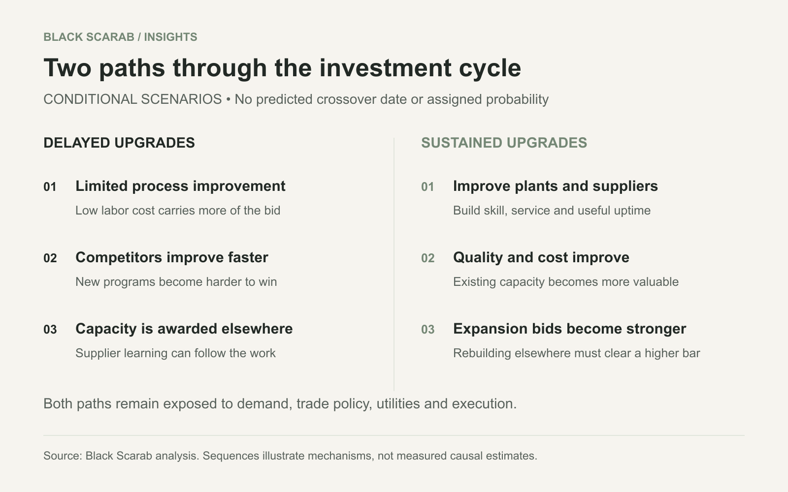

# Mexico Cannot Afford to Lose the Physical AI Race

By Rodolfo Garcia Calderoni, CFA

Nearshoring bought Mexico an opening. Automation will help decide whether it becomes a lasting industrial advantage or a temporary stop on the way to someone else’s factory.

Original AI generated editorial illustration by Black Scarab. This is an interpretation, not a photograph of a real factory.

Mexico’s most dangerous industrial competitor is a factory that has not been built yet. It may sit north of the border, close to its customers. It may sit in China, surrounded by suppliers that keep improving together. What matters is whether it can deliver a better product at a lower total cost when the next production contract is awarded.

For years, Mexico has combined proximity to the United States, competitive labor costs, industrial experience and regional supply chains. Trade tensions with China have made that combination more valuable. But an advantage created partly by the cost of human work becomes less secure as machines absorb more of that work.

Black Scarab’s thesis is that Mexico needs to use the current opening to build productive capabilities that keep improving: efficient plants, capable local suppliers, trained technicians and automation that works through a full shift. The objective is to make staying and expanding in Mexico economically compelling even as factories elsewhere become smarter.

There is no credible date on which all manufacturing suddenly moves home. Nor does the evidence establish that Mexico’s national survival depends on one technology. The danger is more gradual and more plausible: existing plants remain open while new products, engineering work and additional capacity go elsewhere. By the time the loss becomes obvious in the industrial landscape, several investment cycles may already have passed.

## A valuable relationship with unequal exposure

The United States bought $534.3 billion of goods from Mexico in 2025 and sold it $337.3 billion, putting bilateral goods trade at $871.6 billion. More than 80 percent of Mexican goods exports went to the United States in 2024, according to [USTR’s trade summary](https://www.ustr.gov/countries-regions/americas/mexico). The two countries are deeply connected, but Mexico’s export dependence makes the exposure asymmetric.

A tariff on an intermediate component can raise costs for an American manufacturer as well as damage a Mexican supplier. That creates resistance to disruption. It does not make disruption impossible. Governments can accept economic costs in pursuit of political, industrial or security objectives, and firms can redesign sourcing over time.

USTR’s [July 2026 negotiating agenda](https://www.ustr.gov/about/policy-offices/press-office/press-releases/2026/july/united-states-and-mexico-convene-mexico-city-third-bilateral-negotiating-round-related-joint-review) explicitly included automotive rules of origin, steel and aluminum, economic security and other bilateral issues. Associated Press reporting at the start of the review described an uncertain negotiation that could extend for months. [AP’s account](https://apnews.com/article/usmca-mexico-canada-trade-nafta-4531f12f1a59cb2b2e20bcdbdd9d47b5) provides independent context for the commercial uncertainty.

This is why proximity should be treated as an asset to improve, not an insurance policy. A manufacturer deciding where to expand has to evaluate market access alongside delivered cost, reliability, origin documentation and the ability to launch on schedule. A cheaper workcell cannot erase an unfavorable trade rule. A favorable trade rule cannot rescue a factory that repeatedly misses quality or delivery requirements.

Black Scarab chart using USTR data. Dollar flows cover 2025; the export destination share covers 2024. Gross trade flows are not domestic value added or GDP.

## Nearshoring is an opening, not a completed transformation

Research published by Dallas Fed economists in May 2026 finds that trade diversion from China produced a sustained increase in Mexican output. Their model estimates a GDP level gain of about 1.1 percentage points when investment adjusts, versus about 0.4 percentage points with a fixed capital stock. These are model estimates of trade spillovers, not observed annual growth rates or an automation forecast. [Dallas Fed analysis](https://www.dallasfed.org/research/economics/2026/0512).

The important distinction is between receiving demand and building the capacity to serve it. Additional orders can fill unused space in an existing plant. They do not necessarily create a deeper supplier base, stronger engineering capabilities or a new generation of production equipment.

An earlier [Dallas Fed study from December 2024](https://www.dallasfed.org/research/economics/2024/1205) found that new foreign direct investment had not matched the enthusiasm around nearshoring and that reinvested earnings accounted for most inflows. It also explained how contract manufacturing and shelter arrangements can expand activity without appearing as a wave of directly owned foreign factories. That historical finding is a warning against equating every export gain with a completed relocation.

The useful question is what the next peso of investment leaves behind. A building can house production for a time. A network of qualified suppliers, process engineers and service technicians can help win the next product generation. The second kind of investment makes the first more durable.

## China is not vacating the factory floor

China’s transition toward consumption is a policy objective, not a completed retreat from exporting. In February 2026, the [IMF described robust exports alongside weak domestic demand](https://www.imf.org/en/news/articles/2026/02/18/cf-how-chinas-economy-can-pivot-to-consumption-led-growth) and argued for a stronger consumption engine. A larger consumer economy can coexist with formidable manufacturing capacity.

The IFR’s World Robotics 2025 report records about 295,000 industrial robot installations in China during 2024, compared with 34,200 in the United States and 5,600 in Mexico. China represented 54 percent of worldwide installations. Mexican installations declined 4 percent, with automotive accounting for 63 percent. These are annual installations for 2024, not 2026 sales or counts of AI enabled machines. [IFR report](https://ifr.org/worldrobotics/report-2025).

Using those rounded figures, China installed about 53 times as many industrial robots as Mexico. This is a scale comparison, not a claim that Chinese factories are 53 times more productive. Factory output, industrial composition, utilization and workforce size are different. Robot density uses a worker denominator, not the total population, and should not be confused with annual installations.

The [IFR’s Americas release](https://ifr.org/downloads/press_docs/2025-09-25-IFR_press_release_Americas_in_English.pdf) puts China’s operational stock at roughly 2.03 million robots and the US stock at 393,700 in 2024. It also reports that domestic suppliers served 57 percent of China’s robot market. The competitive challenge includes a growing ecosystem of equipment makers and deployment experience, not just a collection of machines.

Mexico does not need to match China’s national robot count. It needs relevant plants and supply chains to match the quality, responsiveness and delivered economics required to retain business. Importing dependable equipment can be part of that strategy. Building the ability to integrate, maintain and improve it locally is what turns the purchase into industrial capability.

Original Black Scarab chart using rounded IFR World Robotics 2025 figures for calendar 2024. These counts do not measure AI adoption, productivity or robots per worker.

## The threshold is delivered cost per good unit

A low hourly wage is valuable only in relation to the work it produces. The manufacturing comparison must include output per hour, saleable yield, downtime, supervision, maintenance, energy, tooling, floor space and working capital. Freight, insurance, border delays and applicable duties then connect the factory gate to the customer.

Capital must also be priced over time. Compare the present value of equipment, integration, operating expense and replacement costs against the present value of useful output. A machine that works three shifts can spread its cost over more units than the same machine serving an intermittent order book. A nominally fast system can become expensive if it often waits for upstream parts or downstream capacity.

The claim that humans remain universally faster than machines does not hold. Plus One Robotics says its specialized InductOne parcel system routinely exceeds 2,500 to 3,200 inducted items per hour in [its discussion of robot foundation models](https://www.plusonerobotics.com/blog/rfm-jack-of-all-trades-or-aces). That is a vendor claim, not an independent benchmark. Parcel mix, staffing, exception handling and operating conditions matter, and it cannot establish a general human versus robot ranking.

The useful comparison is between complete processes doing the same work. A human operator can adapt quickly to unusual parts. A dedicated machine may dominate a stable repetitive task. Learned perception and manipulation can make automation useful across more variation, but an impressive model demonstration is still several steps away from an accepted production cell.

Nor should lower technology prices be assumed to arrive evenly. Better software can reduce engineering effort while integration, specialized tooling, energy or financing become more expensive. The scenarios in this article assume improving automation economics; they do not assert a known annual cost decline or a universal crossover year.

## The decision to upgrade versus rebuild

Consider a deliberately simplified example for the next comparable production program. A Mexican plant can continue with an incremental annual delivered operating cost of $1 million. An upgrade costs $1.2 million today and reduces that annual cost to $700,000. A new US alternative requires $3 million today and costs $550,000 annually. All values are hypothetical and represent only the relevant program costs, not market quotations or the full price of a factory.

Assume equal annual output, equal quality and customer service, immediate commissioning, a ten year horizon, a 10 percent annual discount rate and no terminal value. Operating costs are paid at each year end. The present value factor is 6.145. Continuing costs approximately $6.14 million; upgrading costs $5.50 million; building the US alternative costs $6.38 million. In this example, the Mexican upgrade is the least expensive choice despite the US option’s lower annual operating cost.

If the US initial investment falls to $2 million, its present cost falls to $5.38 million and it becomes slightly cheaper than the Mexican upgrade. At the other assumptions, the break even US investment is approximately $2.12 million. The result is sensitive to capital cost because the upgrade itself has already captured much of the operating improvement.

This is the strategic point: Mexico’s investment changes the benchmark a competitor has to beat. It does not make relocation irrational forever. Better US productivity, incentives, a shift in demand or higher border costs could change the answer again. Conversely, commissioning delays and customer requalification can make a new facility less attractive than this immediate startup example suggests.

Past construction spending is a sunk cost and should not be counted again to justify staying. What matters is future avoidable spending: replacement investment, shutdown costs, ramp losses, qualification, available capacity and the opportunity cost of each option. Taxes, depreciation benefits, financing structure, salvage, demand risk and currency movements are excluded here and must be included in a real decision. Do not count borrowing costs twice by adding them mechanically to a cash flow already discounted at an appropriate capital cost.

Black Scarab hypothetical investment model, not observed plant costs or a forecast. Ten years, 10 percent discount rate, equal output, year end operating costs and no terminal value. Assumptions and exclusions are explained above.

### Hypothetical sensitivity to the discount rate

| Annual discount rate | Continue in Mexico | Upgrade Mexico | US alternative at $3 million |
| --- | --- | --- | --- |
| 6 percent | $7.36 million | $6.35 million | $7.05 million |
| 10 percent | $6.14 million | $5.50 million | $6.38 million |
| 15 percent | $5.02 million | $4.71 million | $5.76 million |

Present cost equals initial investment plus annual operating cost multiplied by the ten year annuity factor. Lower present cost is preferred only under the equal output assumptions.

## Two paths through the next investment cycle

In the first scenario, Mexico’s factories improve slowly while competing production systems become more capable and cheaper to deploy. Plants keep winning work that depends on labor intensive steps or existing relationships. Over time, the most attractive new lines are awarded to facilities with better automation, stronger quality data or more predictable delivery. The erosion begins in investment allocation, not necessarily in factory closures.

Local suppliers then lose opportunities to learn the next process. Skilled technicians leave for better prospects. Maintenance and engineering networks grow elsewhere. The country can remain a significant exporter while losing bargaining power over the more valuable parts of the production system. A healthy current order book would not disprove that risk.

In the second scenario, investment over the next five to ten years improves existing facilities and spreads capability through suppliers. Plants reduce scrap, increase useful machine hours and prove that they can introduce new products without rebuilding the process from scratch. Buyers still compare countries, but the Mexican operation enters that comparison with a stronger operating record and a lower cost of expansion.

These are conditional paths, not forecasts. The likely reality is uneven: a highly capable automotive or electronics plant can coexist with poorly equipped suppliers nearby. The national challenge is to broaden improvement beyond showcase facilities so that the surrounding production network becomes an advantage too.

The timing comes from product cycles, equipment replacement and contract awards. Waiting for a definitive moment when robots become cheaper than workers is the wrong trigger. Each missed program can move customer knowledge and engineering experience elsewhere. The window is measured in opportunities to build capability before those commitments are made.

Black Scarab scenario diagram. These are conditional mechanisms over successive investment cycles, not predicted dates, probabilities or GDP trajectories.

## The first projects should solve expensive problems

The near term opportunity is often inside an existing factory. Inspect a defect that generates costly returns. Automate a repetitive transfer that prevents a machine from running through an additional shift. Improve pallet handling where manual work creates a bottleneck. Reduce changeover effort where frequent product variation makes conventional automation uneconomic.

A hypothetical metal parts supplier illustrates the sequence. First measure spindle utilization, part availability, inspection failures and operator interventions. If the real constraint is missing material or a long tool change, adding a robot may simply create a machine that waits. If consistent loading is the constraint, machine tending with a suitable gripper and reliable exception handling may produce useful additional hours.

A hypothetical electronics supplier has a different problem. A vision system may make sense when defects are visually observable and there is enough representative data to validate detection. The commercial test includes false rejects, missed defects, rework and traceability. It is not the accuracy score of a model on a convenient demonstration set.

A hypothetical packaging operation needs to test actual boxes, labels, reflective surfaces, damaged packaging and product changes. Useful throughput includes recovery from the difficult cases. Removing one visible operator while creating a hidden remote supervision burden can move expense without improving the process.

### A practical first deployment screen

| Application | What to measure | What can defeat the case |
| --- | --- | --- |
| Visual quality inspection | Escaped defects, false rejects, rework and inspection time | Unrepresentative data, changing lighting or defects that cameras cannot observe |
| Machine tending | Useful machine hours, loading time and interventions | Inconsistent fixtures, upstream shortages or unreliable recovery |
| Palletizing and material movement | Delivered throughput across the full shift | Poor flow design, unstable loads or blocked routes |
| Adaptive finishing or welding | Accepted process quality and variation handled | Tool wear, difficult qualification or insufficient process control |

Black Scarab application framework. These are potential use cases, not claims of deployments by named customers.

## The factory stack must survive the real plant

The useful system begins with sensing and ends with a verified production result. Cameras, depth sensors or other instruments observe the work. An industrial computer interprets the observations. Task software requests an action. A robot controller or programmable controller executes within defined operating limits. The plant’s quality and production systems record whether the result is acceptable.

Local computation can reduce dependence on an external network for time sensitive decisions. Cloud services can support fleet analysis, software distribution and model improvement. Neither removes the need for calibration, stable lighting, industrial networking, access control, backups and a recovery procedure when the system fails.

The bill of materials must include the manipulator or mobile base, controller, sensing, compute, gripper or process tool, fixtures, guarding and safety equipment, electrical work and network connections. Integration with the existing manufacturing execution and quality systems can be as important as the robot itself. The safety function requires its own engineering and validation; a learned model’s confidence score is not a safety guarantee.

This is not a case for one mandatory supplier or chip architecture. Procurement should request the vendor’s supported hardware matrix, controller compatibility, component availability and local replacement times. A sensor or processor is not interchangeable merely because it performs a similar function. Validate the actual configuration, software version and maintenance arrangement being quoted.

Mexico’s service layer is consequently part of the product. Spanish language training, accessible documentation, spare components, remote diagnosis and an accountable local technician determine how quickly production resumes. A startup that cannot explain who arrives when a critical cell stops has not finished designing its commercial offer.

## A market entry strategy built around repeatability

A robotics company should start with a narrow process and a cluster it can support well. The first account needs a process owner, an operations sponsor, usable baseline data and a budget attached to an expensive problem. A local integrator can contribute installation experience and customer trust, but responsibilities for software, hardware, safety and service must be explicit.

A paid pilot should specify the production mix, hours of operation, success criteria and handling of exceptions. Acceptance should depend on sustained useful output and quality under agreed conditions. Tie expansion to that evidence. A polished demonstration with selected parts is a sales milestone, not a production acceptance test.

The next installation is the test of the business model. If the same process requires a complete redesign at every site, the company may be building an engineering services business with software inside it. That can be valuable, but the staffing, margins and financing needs differ from a product that deploys repeatedly with limited customization.

Capital purchase, leasing, subscriptions and payments linked to useful output are alternative contract structures. Lower initial payment does not remove economic cost. Buyers need to see service exclusions, minimum volumes, software charges, downtime allocation, termination rights and ownership of production data. Suppliers taking utilization risk need a balance sheet that can survive it.

No comparable public price series establishes a turnkey cost for this diverse market. The investment example above is deliberately hypothetical. A credible quotation must separate equipment, engineering, installation, training, maintenance, software and likely consumables. It should explain which expenses recur and which can be reused at the second site.

## Industrial policy has to reach beyond the robot

Mexico already has investment incentives. Hacienda’s [Plan México tax incentive summary](https://www.estimulosfiscales.hacienda.gob.mx/es/efiscales_mediante_decreto/Plan_Mexico) describes accelerated deductions for qualifying new fixed assets and additional deductions related to training and innovation. These are conditional tax provisions, not a universal robotics grant or proof that a nationwide automation program will be funded. Eligibility and the applicable rules need to be checked for each project.

The stronger policy agenda would connect equipment adoption to the conditions that make it productive. Shared training facilities, supplier development, accessible financing and practical demonstration centers can reduce the cost of the first serious deployment. Support should reward measured improvements and transferable skills rather than a count of robots purchased.

The [OECD’s research on nearshoring](https://www.oecd.org/en/publications/harnessing-nearshoring-opportunities-in-mexico-by-boosting-productivity-and-fighting-climate-change_0ca7fc0a-en.html) identifies transport and digital connectivity, regulation, the rule of law, renewable energy and water scarcity as constraints. A plant full of advanced equipment still needs reliable utilities and a dependable route to market.

Small and medium suppliers deserve particular attention. A sophisticated final assembly plant remains exposed if its upstream network cannot meet tolerances, document quality or deliver consistently. Financing and technical assistance that help those suppliers upgrade can strengthen several customers at once. Imported hardware does not prevent domestic value creation when integration, tooling, maintenance and process knowledge develop locally.

Subsidies are not an inevitable outcome of game theory. Governments face fiscal limits and competing priorities. Poorly designed support can fund idle equipment or preserve weak projects. A disciplined program would evaluate additional productive capacity, supplier participation, training outcomes and sustained utilization, with clear conditions for withdrawing support from failed projects.

## The workforce is part of the advantage

Manufacturing generated approximately 20.1 percent of Mexico’s GDP in 2024, according to the [World Bank’s manufacturing value added series](https://data.worldbank.org/indicator/NV.IND.MANF.ZS?locations=MX). That supports the description of roughly one fifth of the economy. It does not mean that gross exports equal domestic income or that the entire sector is at risk of disappearing.

INEGI reported 9.7 million people working in manufacturing in October 2024, or 16.3 percent of employment. This is a dated employment observation, not a current headcount or the manufacturing share of GDP. [INEGI labor indicators](https://www.inegi.org.mx/contenidos/saladeprensa/boletines/2024/IOE/IOE2024_12.pdf). The scale explains why industrial competitiveness extends well beyond individual factory margins.

Automation can displace particular tasks and jobs even when it improves a plant’s long term prospects. A serious strategy budgets for that transition. Operators can contribute the tacit knowledge needed to diagnose exceptions and improve a cell, but movement into maintenance, quality or programming requires training and cannot simply be assumed.

A country should not define success as keeping wages low enough to postpone investment. Higher productivity creates room for better pay, stronger suppliers and a larger base of skilled work, although those gains depend on how firms and institutions distribute them. The alternative of losing future production programs can also damage employment, with fewer opportunities to shape the transition.

Industrial resilience is therefore partly a question of retaining the capacity to solve problems locally. A factory that depends on a single overseas expert for every failure has installed automation without developing much autonomy. Training, documentation and service capability are productive assets in their own right.

## What would weaken this thesis

If deployment and maintenance costs remain high, automation spreads more slowly. Highly variable, low volume processes may continue to favor people or simpler mechanization. If trade barriers rise enough, even a very efficient Mexican factory may lose access to a customer. If electricity, water or security deteriorate, better workcells may not offset the broader disadvantage.

Some production benefits more from proximity to a specialized supplier ecosystem than from labor savings. Some is constrained by raw materials, energy, regulation or transport. China and the United States will not absorb all manufacturing simply by installing more robots. Mexico’s path depends on sectors, products and specific facilities rather than a single national cost curve.

A3’s September 2026 [industry report on Mexican automation](https://www.automate.org/robotics/industry-insights/the-rise-of-automation-in-mexico-digital-transformation-redefines-emerging-industries) describes an established manufacturing platform and interviews automation suppliers about growing demand. That is evidence of an active market, with the perspective of an industry association, not proof of universal adoption or guaranteed returns.

Track awarded programs, expansion spending, supplier qualification, useful uptime, scrap, customer delivery and the time needed to commission a second site. Robot counts help describe adoption, but they cannot show whether a plant is earning enough to reinvest. If installations rise while utilization and domestic capability stagnate, the strategy is missing its objective.

## Black Scarab verdict

Mexico’s opportunity is to turn a favorable location into a continuously improving production system. That requires sustained investment in equipment, integration, utilities, suppliers and people. The strongest defense against a smarter factory elsewhere is an operation whose economics and capabilities are improving here.

For the companies building the next generation of robotics and industrial intelligence, that creates a substantial but demanding opening. The winning offer is a repeatable production result with financing, integration and service that fit the plant. Technology without a deployment system leaves too much of the commercial problem unsolved.

Mexico does not have to become the cheapest place to perform every task. It has to remain a compelling place to award the next product, expand a line and develop the next supplier. Nearshoring opened the door. The investment decisions being made now will determine how much of that opening becomes lasting capability.

## Sources and analytical method

Research checked September 12, 2026. Statistics retain their observation years; publication dates do not turn 2024 robot counts into 2026 installations. Industry association and company statements are identified as such. The scenarios, application examples and investment model are Black Scarab analysis, not forecasts, customer case studies or vendor quotations.

The four supporting figures are original Black Scarab graphics. The cover is an AI generated editorial illustration. No generated image represents a real product installation. The investment model uses present cost because output is assumed identical across alternatives. It does not estimate employment effects, GDP losses, market size or a date when national manufacturing costs reach parity.

## References

* [IFR, World Robotics 2025, September 25, 2025. Calendar 2024 installations](https://ifr.org/worldrobotics/report-2025)
* [IFR, Americas release, September 25, 2025. Operational stocks and adoption](https://ifr.org/downloads/press_docs/2025-09-25-IFR_press_release_Americas_in_English.pdf)
* [USTR, Mexico trade summary, accessed September 12, 2026. 2025 trade and 2024 exposure](https://www.ustr.gov/countries-regions/americas/mexico)
* [Reyes Heroles, Torres and Morales Burnett, Dallas Fed, May 12, 2026. Trade spillover model](https://www.dallasfed.org/research/economics/2026/0512)
* [Dallas Fed, December 5, 2024. Nearshoring and investment composition](https://www.dallasfed.org/research/economics/2024/1205)
* [IMF, February 18, 2026. China’s consumption transition](https://www.imf.org/en/news/articles/2026/02/18/cf-how-chinas-economy-can-pivot-to-consumption-led-growth)
* [USTR, July 17, 2026. Third bilateral negotiating round agenda](https://www.ustr.gov/about/policy-offices/press-office/press-releases/2026/july/united-states-and-mexico-convene-mexico-city-third-bilateral-negotiating-round-related-joint-review)
* [Associated Press, June 30, 2026. North American trade negotiations](https://apnews.com/article/usmca-mexico-canada-trade-nafta-4531f12f1a59cb2b2e20bcdbdd9d47b5)
* [González Pandiella and Maravalle, OECD, May 7, 2024. Nearshoring constraints](https://www.oecd.org/en/publications/harnessing-nearshoring-opportunities-in-mexico-by-boosting-productivity-and-fighting-climate-change_0ca7fc0a-en.html)
* [Plus One Robotics, accessed September 12, 2026. Vendor throughput claims](https://www.plusonerobotics.com/blog/rfm-jack-of-all-trades-or-aces)
* [A3, September 4, 2026. Automation in Mexico and supplier interviews](https://www.automate.org/robotics/industry-insights/the-rise-of-automation-in-mexico-digital-transformation-redefines-emerging-industries)
* [Hacienda, Plan México incentives, accessed September 12, 2026](https://www.estimulosfiscales.hacienda.gob.mx/es/efiscales_mediante_decreto/Plan_Mexico)
* [INEGI, December 2024 labor release. October 2024 manufacturing employment](https://www.inegi.org.mx/contenidos/saladeprensa/boletines/2024/IOE/IOE2024_12.pdf)
* [World Bank, World Development Indicators, 2024 manufacturing value added; retrieved September 12, 2026](https://data.worldbank.org/indicator/NV.IND.MANF.ZS?locations=MX)
