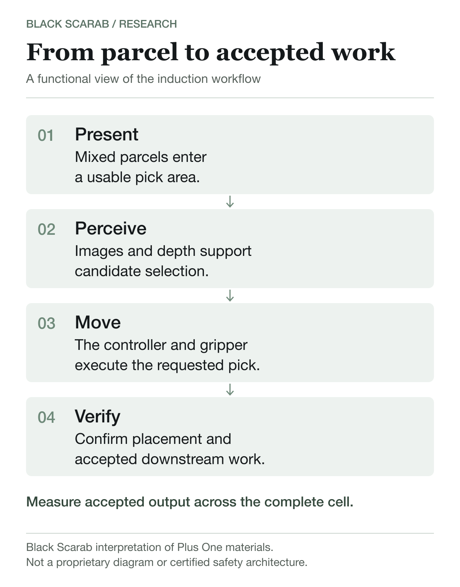
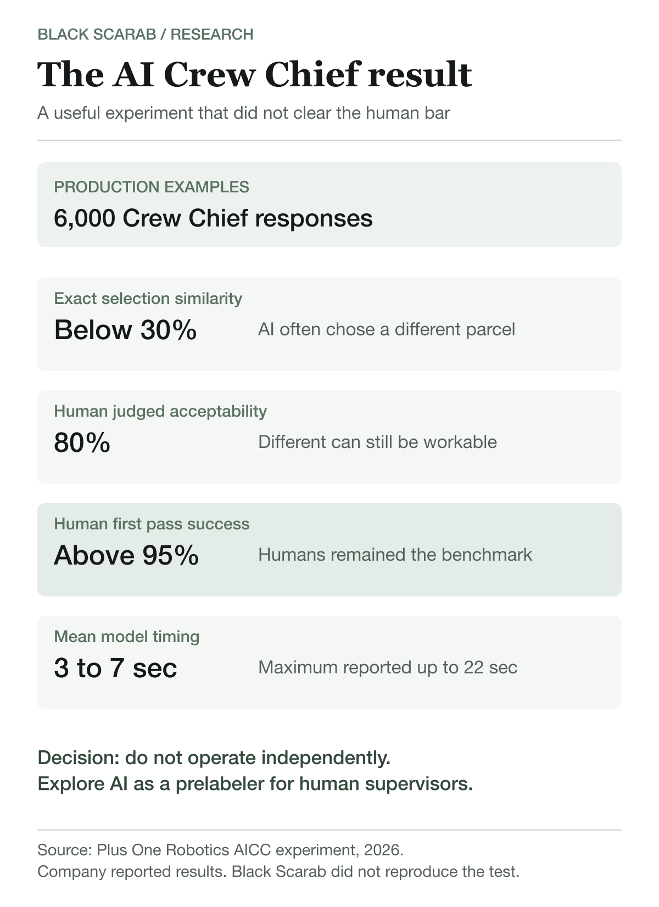
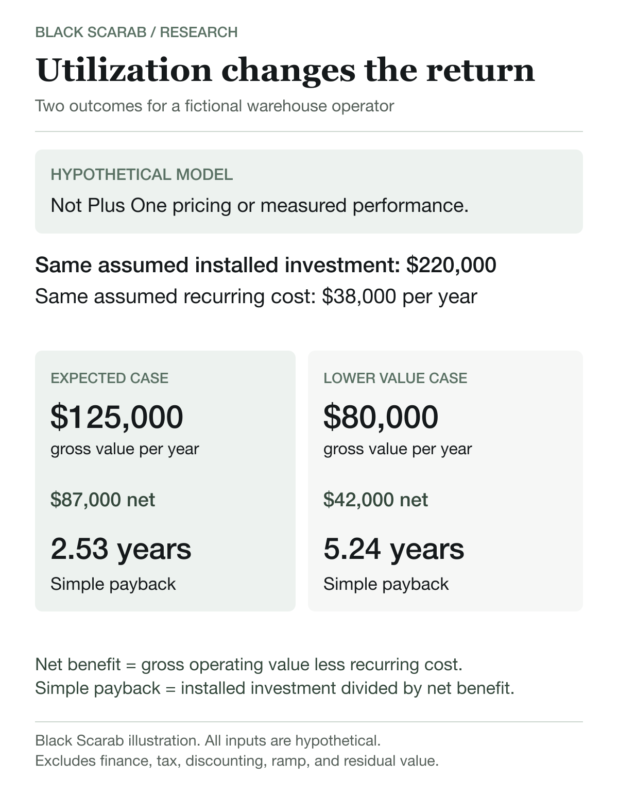

# Plus One Robotics: Can human supervision make warehouse autonomy dependable?

Warehouse robots do not fail only because they are too slow. They fail because the world arriving on the conveyor is messy. A crushed box hides an edge. Two mailers cling together. One difficult scene can stop a machine that handled thousands of ordinary picks.

Plus One Robotics has built its company around that gap between autonomous performance and operating reality. Its proposition is practical: let software handle routine perception, then bring in a remote person when confidence falls.

This article answers four questions:

1. What does Plus One sell, and where does the intelligence sit?
2. How does Yonder change the economics of an exception?
3. What do the disclosed customers, specifications, and AI experiments actually prove?
4. What should a buyer measure before committing capital?

*Written by Rodolfo Garcia Calderoni, CFA.*

## What Plus One sells

Plus One was founded in San Antonio in 2016 by robotics and computer vision specialists with roots in ROS Industrial. Its company history traces PickOne development to work by Shaun Edwards and Paul Hvass, followed by PickOne 1.0 in 2018 and the first Yonder deployment in 2019. [1]

The company now offers two commercial routes. A customer or integrator can embed PickOne into a robotic cell, or buy a more standardized system such as InductOne or DepalOne.

PickOne is the perception and pick guidance layer. It combines two dimensional images with depth data, identifies candidate parcels, scores possible picks, and communicates location information to the robot controller. [2]

Yonder is the exception layer. When the system cannot select a useful action with enough confidence, a remote Crew Chief can review the scene and provide the selection needed to resume. [3]

InductOne packages two robot arms, grippers, cameras, conveyors, safety equipment, analytics, installation, training, and support for parcel induction. DepalOne packages palletizing and depalletizing into cobot, industrial robot, and custom configurations. [4][5]

The distinction matters. Software can create a grasp request, but a robot controller, end effector, conveyor, scanner, safety system, and warehouse controls still have to turn it into accepted work.

## From scene to accepted parcel

The published induction workflow starts when the perception kit captures the pick area. Appearance and depth information support segmentation and geometry. The software chooses a candidate, sends pick information to the robot controller, and the arm executes the motion. [6]

The package then has to remain secure, arrive inside the downstream tolerance, and preserve the next process. Plus One describes motion detection, place verification, double recovery, empty zone detection, and scan in flight functions around that broader outcome.

*Black Scarab functional interpretation of Plus One materials. This is not a proprietary control diagram or certified safety architecture. Sources: [2] and [6].*

This is why advertised robot speed and facility throughput often diverge. Infeed starvation, difficult packaging, unreadable labels, recirculation, blocked chutes, safety stops, maintenance, and downstream congestion all affect accepted output.

The useful metric is not the arm's fastest motion. It is accepted packages per paid hour across representative shifts.

## Yonder changes the cost of uncertainty

Without remote support, a local worker may need to notice a stop, walk to the cell, understand the problem, and restart production. Yonder can resolve some perception problems before that person reaches the machine. Physical faults still require local action.

The architecture also creates a data loop. Plus One's early Yonder patent family describes remote selection information and automated learning from corrected picks. A useful intervention can become both an operating recovery and a labeled example for future model improvement. [7]

That loop is not free labor or unlimited learning. A contract should identify who supplies Crew Chiefs, covered hours, response commitments, concurrency assumptions, data ownership, permitted model training, retention, security, and behavior when the service or network is unavailable.

Supervised autonomy becomes attractive when intervention is infrequent enough that one person can support several cells and response remains fast enough to prevent a queue.

## The AI Crew Chief experiment

In 2026, Plus One published an unusually useful negative result. It tested whether a cloud model could handle some Yonder requests without a person. The experiment combined Meta's Segment Anything Model 2 with Gemini reasoning and used 6,000 examples of human Crew Chief responses from production cells. [8]

The model selected the same object as the human in fewer than 30 percent of the reported validation examples. Expert Crew Chiefs judged 80 percent of generated selections acceptable. Human first pass success exceeded 95 percent.

Mean model timing ranged from three to seven seconds, with maximums as high as 22 seconds. Plus One concluded that current accuracy and timing did not support independent operation.

*Company reported experiment. Results were not independently reproduced by Black Scarab. Source: [8].*

The company is exploring the model as a prelabeler for human supervisors instead. That is strategically coherent. If AI shortens decision time without weakening quality, Yonder could supervise more robots per person while retaining human authority over ambiguous events.

The more important signal is restraint. Plus One disclosed where the model fell short and chose assistance over premature autonomy.

## Packaged systems and published performance

InductOne uses two arms in a compact induction cell. Plus One reports sustained rates of 2,200 to 2,300 parcels per hour, peak capability of 3,300, parcels up to 15 pounds, and dimensions up to 27 by 19 by 17 inches. These are company specifications, not guarantees for every facility or item mix. [4]

Two coordinated arms can improve asset density, but they also create more interdependence. The system has to avoid arm conflicts, synchronize infeed and outfeed, and preserve safe access for recovery and maintenance.

DepalOne moves Plus One toward a standardized pallet product. Its current page lists a starting price of $155,000, typical throughput from 500 to 1,000 packages per hour, capacity up to 70 pounds, palletizing height up to 98 inches, and up to nine cycles per minute with two pallet locations. [5]

The product offers PickOne Lite, Core, and Pro capability tiers for increasingly variable work. That can widen the market if customers can begin with a bounded task and upgrade without replacing the whole cell.

A starting price is not a complete budget. Buyers still need the base configuration, selected software tier, tooling, safety, conveyor interfaces, facility work, freight, installation, validation, training, spares, recurring software, Crew Chief service, and maintenance.

## Hardware and integration ownership

Plus One's current partner page names Honeywell, PSA Systems, EuroSort, Zebra Technologies, NPSG Global, Tompkins Robotics, Fameccanica, Yaskawa, and FANUC. A listed relationship does not establish compatibility with every model, controller, firmware version, or application. [9]

The public FedEx case gives a clearer allocation. Yaskawa Motoman supplied robot arms, grippers, and integration for the initial Memphis deployment. Plus One supplied three dimensional vision, artificial intelligence, and industrial computing. [10]

That split shows why a buyer needs one responsibility matrix for the full cell. Who responds first when accepted output falls? Who owns calibration, controller faults, gripper wear, conveyor timing, remote support, and restoration?

Plus One does not publish a complete current bill of materials for every packaged system. Public pages do not identify the processors, accelerators, memory, storage, thermal limits, or replacement policy inside the industrial compute layer. Those details belong in lifecycle and cybersecurity diligence.

## Commercial evidence and its limits

Plus One says its systems have completed more than 1.5 billion picks across 15 countries. A newer engineering article describes nearly two billion picks. The figures are cumulative company claims rather than audited revenue or shipment measures, but they indicate substantial exposure to production variation. [11][8]

MSC Industrial Supply announced a production packing deployment in Harrisburg in 2020 and an intention to expand across five major fulfillment centers. FedEx deployed four Yaskawa arms using Plus One technology at its Memphis hub in 2020. [10][12]

TechCrunch reported more than 130 deployed robots in 2023 when Plus One raised a $50 million Series C, bringing reported funding at the time to $94 million. [13]

The public evidence establishes real deployments and operating history. It does not reveal current installed units, revenue, profitability, customer concentration, renewal rates, intervention frequency, Crew Chief queue time, uptime, or complete customer returns.

Those gaps should become diligence questions, not assumptions.

## One buyer case, two returns

Consider Northline Distribution, a fictional operator unloading mixed cartons from pallets for two shifts. This is not a Plus One customer, quotation, or performance claim.

Assume a complete installed investment of $220,000. That is above the published DepalOne starting price because it includes hypothetical integration, validation, training, and contingency.

In an expected case, assume $125,000 of annual labor, capacity, and safety related value, plus $38,000 of recurring software, service, maintenance, and operating cost. Net annual benefit is $87,000. Simple payback is about 2.53 years.

In a lower value case, annual gross value reaches only $80,000 while recurring cost remains $38,000. Net annual benefit falls to $42,000. Simple payback stretches to about 5.24 years.

*Black Scarab hypothetical model. All inputs are assumptions for explanation, not Plus One pricing or measured results. Excludes financing, tax, discounting, ramp time, residual value, and unmodeled downtime.*

The robot did not change. Utilization, process flow, remaining supervision, and accepted output changed the investment case.

Redeployed labor should not be counted as cash savings unless the financial benefit is real. Value may instead come from avoiding overtime, filling vacancies, increasing accepted volume, reducing injury exposure, or moving people to work that changes revenue or service.

## The implementation lesson

The Plus One sponsored ebook supplied for this research is most useful as an implementation framework. Its contributors emphasize three conditions: quantify the business case, build the cross functional team early, and treat the automation supplier as a long term operating partner. [14]

The guide warns that a robot can appear to be the bottleneck when upstream or downstream flow prevents it from reaching expected throughput. It recommends involving operations, maintenance, information technology, finance, safety, human resources, and affected workers before commissioning.

Training cannot end at launch. Operators need normal production, immediate recovery, escalation, and remote support procedures. Managers need review intervals tied to throughput, quality, safety, interventions, downtime, and financial results.

## Alternatives and limitations

The strongest alternative may be process redesign. Better parcel presentation, inexpensive fixtures, different conveyor logic, or a narrower item set can reduce the need for intelligence. Structure can be cheaper than perception when the process can change.

Conventional automation remains attractive for stable geometry and predictable presentation. Another integrated cell may offer different hardware, service, or ownership boundaries. A very large operator may build internally, but then owns integration, model operations, on call support, cybersecurity, safety validation, and hardware lifecycle.

A fair comparison uses the same parcels, accepted output definition, shifts, service coverage, building constraints, and contract horizon.

The central Plus One risk is that resilience can hide complexity. A cell may depend on robot hardware, cameras, compute, conveyors, controls, remote Crew Chiefs, cloud services, integrators, and local maintenance.

## Black Scarab verdict

Plus One has chosen a commercially grounded answer to an uncomfortable truth: production autonomy is rarely perfect, and the last difficult cases can dominate downtime.

PickOne handles the repeatable perception problem. Yonder turns human judgment into an exception service and a source of training data. InductOne and DepalOne move the company toward products that buyers can evaluate as complete operating systems.

The strongest strategic asset may be the combination of installed experience and corrected edge case data. The 2026 AI Crew Chief experiment shows how that data could reduce the burden on humans over time. It also shows that people remain the stronger decision makers in the disclosed test.

Plus One wins when its many layers behave like one accountable product and when the next deployment needs less custom work than the last.

Buyers should evaluate the system on accepted packages per paid hour, sustained across real shifts, with every intervention and operating cost included. The fastest pick is interesting. Dependable warehouse output is what pays the bill.

## Sources and method

Adapted from Black Scarab's September 9, 2026 website research. Product descriptions and performance figures are company reported unless otherwise identified. Engineering interpretations, buyer recommendations, and the fictional economics are Black Scarab analysis. We have not independently tested the equipment or accessed unpublished customer results.

1. [Plus One Robotics company history](https://www.plusonerobotics.com/about)
2. [PickOne vision software](https://www.plusonerobotics.com/pick-one)
3. [Yonder supervised autonomy](https://www.plusonerobotics.com/human-in-the-loop)
4. [InductOne](https://www.plusonerobotics.com/inductone)
5. [DepalOne](https://www.plusonerobotics.com/depalone)
6. [Automated parcel induction workflow](https://www.plusonerobotics.com/automated-parcel-induction)
7. [Yonder patent family](https://patents.google.com/patent/US20200319627A1/en)
8. [AI Crew Chief in the Cloud experiment](https://www.plusonerobotics.com/blog/from-human-in-the-loop-to-ai-in-the-loop-the-aicc-experiment)
9. [Plus One Robotics partners](https://www.plusonerobotics.com/partners)
10. [FedEx deployment case study](https://www.plusonerobotics.com/case-studies/fedex-automation-success)
11. [Plus One Robotics](https://www.plusonerobotics.com/)
12. [MSC Industrial Supply announcement](https://cdn.mscdirect.com/global/media/pdf/corporate/press-releases/20200304_plusone.pdf)
13. [Series C reporting](https://techcrunch.com/2023/03/07/plusone-raises-50m-for-its-parcel-robotics-vision-systems/)
14. [The Key to Successful Automation Initiatives](https://info.plusonerobotics.com/hubfs/White%20Papers/Plus%20One%20Robotics%20-%20The%20Key%20to%20Successful%20Automation%20Initiatives%20Ebook.pdf?hsLang=en)

